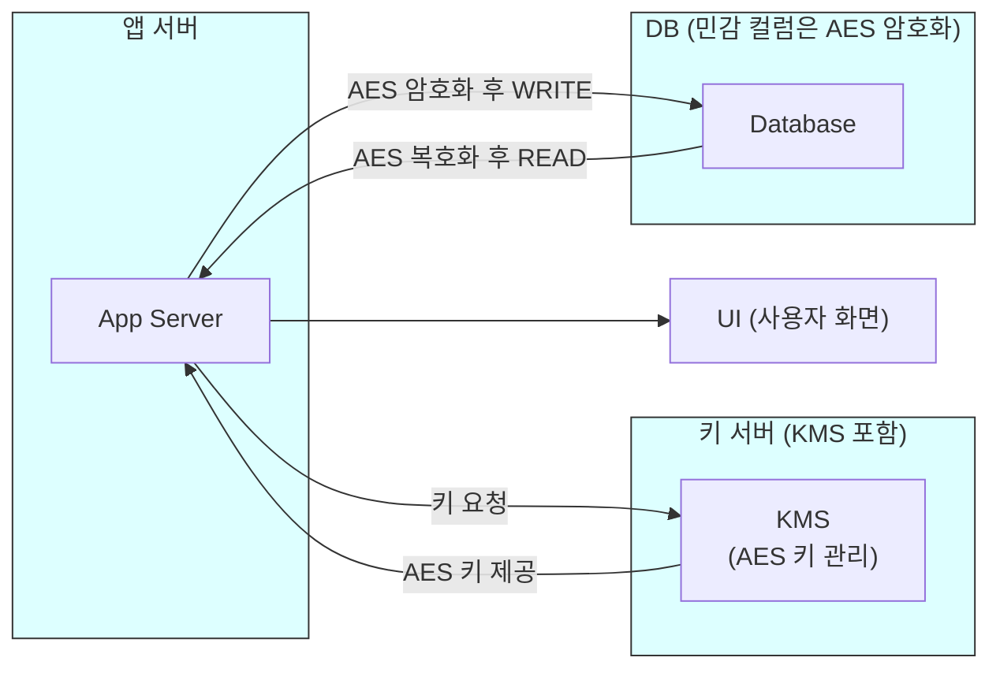

```mermaid
flowchart LR
    %% ─────────────  컴포넌트 ─────────────
    subgraph APP["앱 서버"]
        APP_SRV["App Server"]
    end  
  
    subgraph KEY["키 서버 (KMS 포함)"]
        KMS["KMS\n(AES 키 관리)"]
    end

    subgraph DATA["DB (민감 컬럼은 AES 암호화)"]
        DB["Database"]
    end

    UI["UI (사용자 화면)"]

    %% ─────────────  데이터·키 흐름 ─────────────  
    APP_SRV -->|키 요청| KMS
    KMS -->|AES 키 제공| APP_SRV

    APP_SRV -- "AES 암호화 후 WRITE" --> DB
    DB -- "AES 복호화 후 READ" --> APP_SRV
    APP_SRV --> UI

    %% (선택) 보안 영역 표시용 클래스
    classDef secure fill:#dff,stroke:#333,stroke-width:1px;
    class APP,KEY,DATA secure;
```

