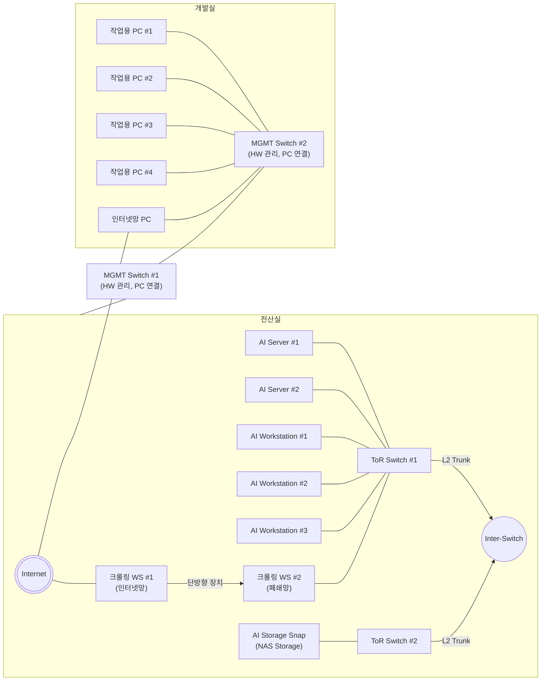

```mermaid
flowchart LR
    %% ─────────────  네트워크/인터넷  ─────────────
    Internet(((Internet)))
    %% ─────────────  전산실 (서버 룸)  ─────────────
    subgraph SR["전산실"]
        direction TB
        %% ── 스위치 및 스토리지  
        ToR1["ToR Switch #1"]  
        ToR2["ToR Switch #2"]  
        Interlink((Inter-Switch))  
        Storage["AI Storage Snap<br/>(NAS Storage)"]  
        %% ── 서버 & 워크스테이션  
        AI_Server1["AI Server #1"]  
        AI_Server2["AI Server #2"]  
        AI_WS1["AI Workstation #1"]  
        AI_WS2["AI Workstation #2"]  
        AI_WS3["AI Workstation #3"]  
        %% ── 크롤링용 워크스테이션  
        Crawling1["크롤링 WS #1<br/>(인터넷망)"]  
        Crawling2["크롤링 WS #2<br/>(폐쇄망)"]  
        %% ── 스위치 연결  
        ToR1 -- "L2 Trunk" --> Interlink  
        ToR2 -- "L2 Trunk" --> Interlink  
        Storage --- ToR2  
        AI_Server1 --- ToR1  
        AI_Server2 --- ToR1  
        AI_WS1 --- ToR1  
        AI_WS2 --- ToR1  
        AI_WS3 --- ToR1  
        Crawling2 --- ToR1    
        %% ── 단방향 장치  
        Crawling1 -- "단방향 장치" --> Crawling2  
        %% ── 외부 인터넷 연결  
        Internet --- Crawling1  
    end  
    %% ─────────────  관리 스위치 계층  ─────────────  
    MGMT1["MGMT Switch #1<br/>(HW 관리, PC 연결)"]  
    SR --- MGMT1  
    %% ─────────────  개발실  ─────────────  
    subgraph DEV["개발실"]
        direction TB
        MGMT2["MGMT Switch #2<br/>(HW 관리, PC 연결)"]  
        PC1["작업용 PC #1"]  
        PC2["작업용 PC #2"]  
        PC3["작업용 PC #3"]  
        PC4["작업용 PC #4"]  
        InetPC["인터넷망 PC"]  
        PC1 --- MGMT2  
        PC2 --- MGMT2  
        PC3 --- MGMT2  
        PC4 --- MGMT2  
        InetPC --- MGMT2  
        Internet --- InetPC  
    end  
    %% ── 관리 스위치 간 연결  
    MGMT1 --- MGMT2
```

