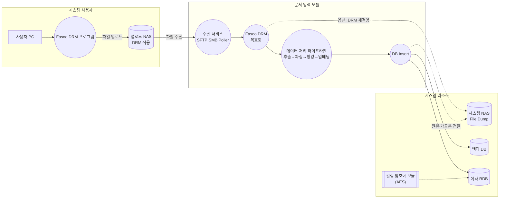

```mermaid
flowchart LR
    %% ─────────────  사용자 측  ─────────────
    subgraph USER["시스템 사용자"]
        UserPC[사용자 PC]
        FasooClient((Fasoo DRM 프로그램))
        UploadNAS[(업로드 NAS<br/>DRM 적용)]
        UserPC --> FasooClient -->|파일 업로드| UploadNAS
    end
  
    %% ─────────────  문서 입력 모듈  ─────────────
    subgraph INGEST["문서 입력 모듈"]
        style INGEST fill:#fffff0,stroke:#333,stroke-width:1px
        Collector((수신 서비스<br/>SFTP·SMB Poller))
        Decrypt((Fasoo DRM<br/>복호화))
        Pipeline((데이터 처리 파이프라인<br/>추출→파싱→청킹→임베딩))
        DBInsert((DB Insert))
        Collector --> Decrypt --> Pipeline --> DBInsert
    end
  
    %% ─────────────  내부 저장소 & DB  ─────────────
    subgraph STORAGE["시스템 리소스"]
        SystemNAS[(시스템 NAS<br/>File Dump)]
        VDB[(벡터 DB)]
        RDB[(메타 RDB)]
        ColEnc[["컬럼 암호화 모듈<br/>(AES)"]]
    end
    UploadNAS -->|파일 수신| Collector
    DBInsert --> VDB
    DBInsert --> RDB
    ColEnc -.-> RDB
    Decrypt -. "옵션: DRM 재적용" .-> SystemNAS
    DBInsert -. "원본·가공본 전달" .-> SystemNAS
```
