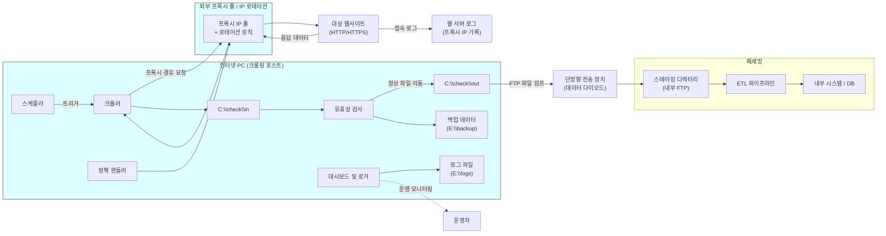

```mermaid
flowchart LR
    %% ─────────────  외부 / 인터넷 영역  ─────────────
    subgraph EXTERNAL["인터넷 PC (크롤링 호스트)"]
        direction TB
        CRAWLER["크롤러"]
        SCHED["스케줄러"]
        POLICY["정책 핸들러"]
        VALID["유효성 검사"]
        IN_F["C:\\check\\in"]
        OUT_F["C:\\check\\out"]
        DASHLOG["대시보드 및 로거"]
        LOGS["로그 파일\n(E:\\logs)"]
        BACKUP["백업 데이터\n(E:\\backup)"]
    end
  
    %% 프록시 풀  
    subgraph PROXY["외부 프록시 풀 / IP 로테이션"]
        PROXIES["프록시 IP 풀\n+ 로테이션 로직"]
    end
  
    TARGETS["대상 웹사이트\n(HTTP/HTTPS)"]
    WEBLOG["웹 서버 로그\n(프록시 IP 기록)"]
  
    %% 크롤링·응답·로그 흐름  
    SCHED -->|트리거| CRAWLER
    POLICY --> PROXIES
    CRAWLER -- "프록시 경유 요청" --> PROXIES --> TARGETS
    TARGETS -- "응답 데이터" --> PROXIES --> CRAWLER
    TARGETS -- "접속 로그" --> WEBLOG
  
    %% 신규: 수집 파일 → 유효성 검사 → 아웃 폴더  
    CRAWLER --> IN_F
    IN_F --> VALID
    VALID -- "정상 파일 이동" --> OUT_F

    %% 백업본 저장
    VALID --> BACKUP
      
    %% 로그 파일 저장
    DASHLOG --> LOGS
  
    DASHLOG -.->|운영 모니터링| OPERATOR["운영자"]

    %% ─────────────  단방향 전송  ─────────────
    OUT_F -- "FTP 파일 덤프" --> DIODE["단방향 전송 장치\n(데이터 다이오드)"]
  
    %% ─────────────  내부 / 폐쇄망 영역  ─────────────
    subgraph INTERNAL["폐쇄망"]
        STAGE["스테이징 디렉터리\n(내부 FTP)"]
        ETL["ETL 파이프라인"]
        SYS["내부 시스템 / DB"]
    end
  
    DIODE --> STAGE --> ETL --> SYS
  
    %% 스타일 옵션 (기존 유지)  
    classDef zone fill:#dff,stroke:#333,stroke-width:1px;
    class EXTERNAL,PROXY zone;
```

